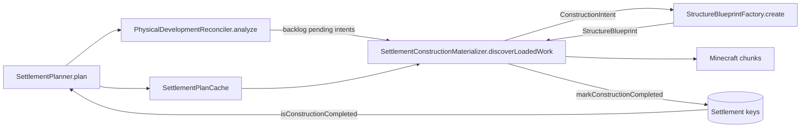
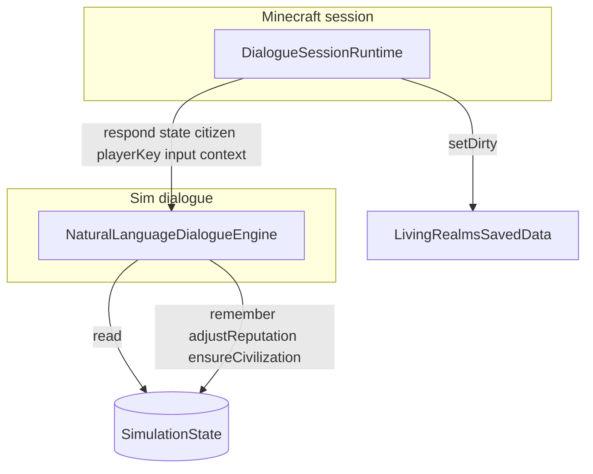

# Architecture inventory (modular-monolith refactor)

Depth pass: five high-mass classes on branch `cursor/architecture-depth-pass-f4a7`. Line counts are approximate (source as of inventory date).

---

## 1. `NaturalLanguageDialogueEngine` (~215 lines, ~51KB compiled)

**Path:** `src/main/java/dev/livingrealms/sim/dialogue/NaturalLanguageDialogueEngine.java`

### Responsibilities

- **Conversation orchestration:** `respond(SimulationState, SocialCitizen, playerKey, input, DialogueContext)` — intent dispatch, response assembly, action list, context update.
- **NLU (no LLM):** `parse(String, DialogueContext)` — normalization, follow-up resolution (`ASK_SOURCE`, `ASK_DIRECTION`), `DialoguePhraseTable.longest` matching, fallback `UNKNOWN`.
- **Domain Q&A handlers (private `answer*`):** self/age/job/family/health; ruler/dynasty/settlement/faction/politics/law/crime/tax; food/water/resources/trade/price/technology/school; war/army/guards/route/migration; culture/religion/history/rumor/calendar; danger/direction/source/recent/help/opinion.
- **Social gameplay:** `interaction`, `reportInformation` — relationship deltas, memories, reputation, guard alerts.
- **Presentation helpers:** `compose` (deterministic phrasing), `level`/`stockLevel`/`pretty`, resource parsing (`parseResource`, Dutch/English aliases), spatial narration (`direction`, `directionPhrase`, `findKnownSettlement`).
- **Knowledge gating:** `authority`, role-based detail tiers, citizen `latestMemory` filters, `WorldCauseExplainer.settlementPressureCause` for causal prose.

### State owned

- **None at class level** — stateless service; only nested `record Parsed(DialogueIntent, DialogueTopic, String subject)`.
- **Per-call mutable inputs:** `DialogueContext` (updated via `context.update(...)`); `List<DialogueAction> actions` built per `respond`.

### Dependencies (calls into)

| Area | Types / APIs |
|------|----------------|
| World clock & lookup | `SimulationState.clock()`, `findFaction`, `findSettlement`, `findSettlementOwner`, `findSocialCitizen` |
| Civilization (lazy ensure) | `ensureSettlementCivilization`, `ensureFactionCivilization` |
| Social | `SocialCitizen`, `CitizenMemory`, `MemoryType`, `CitizenRelationship`, `FamilyBond`, `GuildRank` |
| Faction / settlement | `Faction`, `Settlement`, `DynastyState`, `Army`, `ResourceType`, `ResourceClaim` |
| Economy | `LocalMarketEngine.quote` |
| Transport | `TransportRoute`, `CartographicKnowledgeEngine.localPrecision` |
| Justice / crime | `state.crimeLedger()`, `state.justiceCases()`, `JusticeCase` |
| Diplomacy / war | `state.wars()`, `WarState` |
| Society / events | `CivicEvent`, `AssistanceTask`, `LegendRecord`, `FaithCatalog`, `CivilizationCalendar` |
| Dialogue infra | `DialogueIntent`, `DialogueTopic`, `DialogueAction`, `DialogueActionType`, `DialogueContext`, `DialoguePhraseTable`, `DialogueResult` |
| Roles | `CitizenRole` |
| Explainers | `WorldCauseExplainer` |

### Mutations performed

- **`SocialCitizen.remember(...)`** — every `respond` (conversation log); plus `interaction`, `reportInformation`, threat/insult paths.
- **`CitizenRelationship.adjust(...)`** — `interaction` (compliment, apologize, threaten, insult).
- **`state.playerStanding(playerKey).adjustReputation(factionId, ...)`** — `interaction`.
- **`DialogueContext.update(intent, topic, subject, day)`** — end of `respond`.
- **Lazy civilization materialization:** `ensureSettlementCivilization` / `ensureFactionCivilization` may create or fill civilization side-records on first dialogue touch (same pattern as other sim engines).
- **Does not** mutate settlements, factions, wars, or construction keys directly.

### Callers (ripgrep)

| Caller | Usage |
|--------|--------|
| `dev.livingrealms.minecraft.network.DialogueSessionRuntime` | Static `ENGINE`; `open` / `openAdopted` / `reply` → `respond` |
| `dev.livingrealms.sim.dialogue.DialoguePhraseTable` | Javadoc reference to `parse` |
| Tests | `CivilizationLayerTest`, `SocietyDialogueTest`, `DialogueTokenTest`, `SettlementTransferTest`, `HumanityLifecycleTest`, `FaithAndInfrastructureTest` |

### Persistence coupling

- Indirect: all writes go through **`SocialCitizen`** (memories, relationships) and **`PlayerStanding`** on `SimulationState`, which are serialized with realm save data.
- **`DialogueContext`** is session-transient (`DialogueSessionRuntime.SESSIONS`), not persisted.
- **`ensure*Civilization`** touches civilization maps on `SimulationState` (persisted if newly created).

### Minecraft coupling

- **None in this class** — pure `sim.*` / `sim.dialogue` / `sim.social` / `sim.civilization`.
- Minecraft entity/session wiring lives in **`DialogueSessionRuntime`** (distance checks, packets, gift shrink, guard targeting).

### Client coupling

- **None direct.** Client receives text via network payloads built in `DialogueSessionRuntime`; `DialogueAction` side effects (waypoints, trade bridge) applied server-side.

### Circular responsibilities / entanglement

- **Omnibus “world explainer”:** one class reads crime, war, markets, routes, legends, civic events, assistance tasks, dynasties, and civilization pressure — dialogue becomes a secondary read API for half the sim.
- **Lazy `ensure*Civilization` on read paths** blurs query vs. initialization (side effect during conversation).
- **`answerHelp`** embeds command hints (`/livingrealms assist deliver`) and synthesizes `OFFER_TASK` actions from both `AssistanceTask` list and civilization pressure heuristics.
- **Duplicated market knowledge:** `LocalMarketEngine` here vs. trade UI elsewhere.

### Suggested extraction targets (justified by existing code)

| Target module | Extract | Rationale |
|---------------|---------|-----------|
| `dialogue-nlu` | `parse`, `normalize`, `DialoguePhraseTable` integration, `inferTopic`, `subjectFor` | Already isolated entry; no `SimulationState` in `parse` except context. |
| `dialogue-resolvers` | One resolver per `DialogueTopic` / intent cluster (`SettlementDialogue`, `WarDialogue`, `EconomyDialogue`, …) | `respond` switch is the natural seam; each resolver: `(state, citizen, parsed, day) → (text, actions)`. |
| `dialogue-social` | `interaction`, `reportInformation`, opinion/gift/threat paths | Sole writers of relationship + player reputation from chat. |
| Keep in core | `respond` orchestration + `DialogueContext` contract | Thin coordinator. |

---

## 2. `StructureBlueprintFactory` (~684 lines, ~46KB)

**Path:** `src/main/java/dev/livingrealms/sim/construction/StructureBlueprintFactory.java`

### Responsibilities

- **Blueprint factory:** `create(ConstructionIntent)` — `switch (intent.role())` to ~40 structure generators (`keep`, `townHall`, `house`, `farm`, `road`, … wizard variants).
- **Culture-aware housing:** `house(ConstructionIntent)` — `CultureArchitectureProfile.forIntent`, size thresholds (mansion / `apartmentBlock` / culture-specific cottages, longhouses, etc.).
- **Override API:** `create(ConstructionIntent, CultureArchitecture)` — binds settlement architecture then builds `HOUSE`.
- **Procedural geometry DSL:** shared builders — `foundation`, `shell`, `doorway`, `windows`, `pitchedRoof`, `flatRoof`, `battlements`, `furnishHome` (bed pairs for materializer), `clear` (AIR phases).
- **Road styling:** `road` uses `StreetType.forWidth` + rural vs urban sidewalk/furniture rules.
- **Deterministic variation:** `variant(intent, bound)` hash from `settlementId` + intent key.

### State owned

- **None** (static utility class).
- **Process-wide side channel:** reads/writes **`CultureArchitectureProfile`** settlement bindings via `create(intent, CultureArchitecture)` → `bind(settlementId, culture)`; `house()` reads `forIntent` → `peek(settlementId)`.

### Dependencies

- `ConstructionIntent`, `StructureRole`, `StructureBlueprint`, `BlockPlacement`, `PaletteSlot`, `ConstructionPhase`
- `CultureArchitecture`, `CultureArchitectureProfile` (`forIntent`, `bind`, `derive` fallback)
- `StreetType` (road blueprints)

### Mutations performed

- **In-memory only:** `CultureArchitectureProfile.bind` when using culture override overload.
- **Output:** immutable `StructureBlueprint` lists (no canonical settlement mutation).

### Callers (ripgrep)

| Caller | Usage |
|--------|--------|
| `SettlementConstructionMaterializer` | `buildingOperations`, `terrainFollowingOperations` → `create(intent)` |
| `ConstructionJob` | `resolve` → `create(intent)` at fixed `groundY` (headless / simpler path) |
| `PropertyRightsEngine` | Blueprint footprint for property logic |
| Tests | `SettlementStreetGraphTest`, `SocietyInfrastructureTest`, `OrganicMorphologyAndCauseTest`, `WorldgenQualityTest`, `ProductionQualityTest`, `LivingWorldDensityTest`, `CoreSimulationTest`, `SystemCompletenessTest`, `WizardTreesTest`, `CultureArchitectureDerivationTest` |

### Persistence coupling

- **None** — pure function of `ConstructionIntent` (+ optional JVM-global culture binding map, not saved).

### Minecraft coupling

- **None** — slot-based blueprints; comment states palettes resolved later by adapter (`FactionBlockPalette` in materializer).

### Client coupling

- **None.**

### Circular responsibilities / entanglement

- **Housing massing + culture policy** in one file with civic/industrial/military/wizard geometry.
- **Implicit coupling to planner:** `CultureArchitectureProfile` bindings must be set by `SettlementPlanner.plan` before house blueprints are consistent in-process.
- **`ConstructionJob.resolve` vs materializer** duplicate blueprint→operation projection (materializer adds terrain, doors, entrance planner).

### Suggested extraction targets

| Target | Extract |
|--------|---------|
| `blueprint-housing` | `house`, culture switches, `furnishHome`, residential variants |
| `blueprint-civic` | halls, market variants, temple, courthouse, etc. |
| `blueprint-infrastructure` | `road`, `plaza`, `wall`, `gate`, `aqueduct`, `irrigation` |
| `blueprint-grammar` | `foundation`/`shell`/roof helpers shared module |
| Keep | `create(ConstructionIntent)` façade delegating by `StructureRole` |

---

## 3. `SettlementPlanner` (~674 lines, ~46KB)

**Path:** `src/main/java/dev/livingrealms/sim/construction/SettlementPlanner.java`

### Responsibilities

- **Master plan:** `plan(Faction, Settlement)` → ordered `List<ConstructionIntent>` (immutable copy).
- **Pending filter:** `pending` → `plan` minus `settlement.isConstructionCompleted(key)`.
- **Layout metadata:** `layoutArchetype(Settlement)` / `(Faction, Settlement)` → `SettlementMorphology.derive(...).wireName()`.
- **Morphology-driven roads:** `addRoadNetwork` — tier/morphology branches (`COASTAL_PORT`, `RIVER_TOWN`, `HILL_TOWN`, `RADIAL_CAPITAL`, `ORGANIC_MEDIEVAL`, …).
- **Residential pipeline:** `addHousing` + `extendSideStreetsForHousing` — `SettlementStreetGraph`, `SettlementParcelPlanner`, `DevelopmentMode` (PLAYER_LED / HYBRID / auto).
- **Peripheral economy:** `addFarms`, `addPastures` (population-scaled, morphology-aware placement).
- **Tier-gated civic catalog:** well → village bundle (market, temple, mill, …) → town (barracks, school, prison, …) → city (walls, gates, monument, aqueduct, airfield).
- **Capital / player-founded rules:** town hall vs keep ordering; keep sizing from capital + tier.
- **Priority policy:** `adjustPriority(DevelopmentPriority, StructureRole, base)`; final `replaceAll` + sort by priority.
- **Geometry helpers:** `local` rotation, `civicPoint`, `addAt`, `key` generation (tier-scoped keys for road/keep/wall/gate).

### State owned

- **None** (static).
- **Side effect:** `CultureArchitectureProfile.bind(settlement.id(), cultureProfile.architecture())` at start of `plan`.

### Dependencies

- `Faction`, `Settlement`, `SettlementOrigin`, `DevelopmentMode`, `DevelopmentPriority`, `SimPosition`
- `SettlementMorphology`, `SettlementGrowthLayer`, `StreetType`
- `CultureArchitectureProfile`, `CultureArchitecture`
- `SettlementStreetGraph`, `SettlementParcelPlanner`
- Reads **`settlement.completedConstruction()`** only in `pending` (via `isConstructionCompleted`).

### Mutations performed

- **None on `Settlement` / `Faction` during `plan`.**
- **`CultureArchitectureProfile.bind`** (JVM-global, affects subsequent `StructureBlueprintFactory` house massing).

### Callers (ripgrep)

| Caller | Usage |
|--------|--------|
| `SettlementPlanCache` | Cached `SettlementPlanner.plan` |
| `PhysicalDevelopmentReconciler` | `pending` for backlog |
| `SettlementConstructionMaterializer` | Indirect via reconciler / economy planners / `SettlementPlanCache` |
| `CitizenRoutinePlanner` | `pending` + economy pending |
| `CivilizationLifecycleEngine` | shelter pending counts |
| `HouseholdHomeBinder`, `SettlementDistrictPlan`, `IndustrySitePlanner`, `CivicFestivalDecorationPlanner`, `ForeignSettlementAdoption` | `plan` / stream intents |
| `FactionCitizenMaterializer`, `PlayerMarketRuntime` | locate completed structures (prison, keep, market) |
| Many tests | plan determinism, tier growth, morphology |

### Persistence coupling

- **Inputs from persisted settlement:** tier, population, housing, `developmentMode`/`developmentPriority`, `origin`, `completedConstruction` keys, geography, position.
- **Outputs are derived** each call (cached by `SettlementPlanCache` key); intents themselves not stored — only completion keys on `Settlement`.

### Minecraft coupling

- **None** — strategic coordinates only (`SimPosition`).

### Client coupling

- **None direct** (dashboard may show settlement stats influenced by planned-but-incomplete work via other builders).

### Circular responsibilities / entanglement

- **Single class owns:** street morphology, parcel layout, housing counts, civic catalog, walls/gates, and development policy — hard to test or replace one layer.
- **Global culture bind** ties planner execution order to blueprint factory in same JVM (ordering bug = wrong architecture).
- **Many downstream callers re-run full `plan`** for one intent lookup (market, prison, homes) — performance/semantic coupling to complete plan cost.

### Suggested extraction targets

| Target | Extract |
|--------|---------|
| `settlement-morphology` | Already partially `SettlementMorphology`; keep road network generation per morph |
| `settlement-parcels` | `addHousing`, `extendSideStreetsForHousing` + parcel planner integration |
| `settlement-civic-catalog` | Tier-gated `addCivic` tables and `civicPoint` offsets |
| `construction-intent-keys` | `key(...)`, priority adjustment |
| Facade | `SettlementPlanner.plan` composes sub-planners |

---

## 4. `RealmDashboardCodec` (~228 lines, ~40KB)

**Path:** `src/main/java/dev/livingrealms/sim/ui/RealmDashboardCodec.java`

### Responsibilities

- **Wire protocol:** `encode(RealmDashboardSnapshot)` → JSON string; `decode(String)` → snapshot.
- **Schema version gate:** `v` must equal `RealmDashboardSnapshot.PROTOCOL_VERSION`.
- **Size bound:** `MAX_JSON_CHARS` (262_144); encode throws if exceeded; decode rejects oversize input.
- **Snapshot projection mapping:** nested encode/decode for jurisdiction, player, realm, settings, factions, settlements, wars, warfare, bounties, operations, ecology, politics, forces, strategic map, history.
- **Defensive decode:** list limits from `RealmDashboardBuilder.MAX_*` constants per section.
- **JSON mechanics:** `MiniJson.stringify` / `parse`; typed helpers `obj`, `list`, `longNum`, `str`, `bool`, etc.

### State owned

- **Constants only:** `MAX_JSON_CHARS`.
- **No instance fields.**

### Dependencies

- `RealmDashboardSnapshot` (+ all nested view records)
- `RealmDashboardBuilder` (limit constants only)
- `dev.livingrealms.sim.data.MiniJson`

### Mutations performed

- **None** (pure transform).

### Callers (ripgrep)

| Caller | Usage |
|--------|--------|
| `LivingRealmsNetwork` | Server: `encode` after `RealmDashboardBuilder.build` |
| `DashboardSnapshotPayload` | Validates length against `MAX_JSON_CHARS` |
| `DashboardClientState` | Client: `decode` incoming JSON |
| Tests | Round-trip, protocol rejection, size bounds (`SystemCompletenessTest`, `Schema18FollowUpTest`, `OrganicMorphologyAndCauseTest`) |

### Persistence coupling

- **None** — transport DTO codec; snapshot is ephemeral per request.

### Minecraft coupling

- **Transport only** — used from NeoForge network layer and client UI state; no world/block APIs.

### Client coupling

- **Strong protocol coupling:** client `DashboardClientState` must decode same schema; field names and limits are the contract.

### Circular responsibilities / entanglement

- **Large flat codec** mirrors entire `RealmDashboardSnapshot` surface (map layers, ecology, forces, operations) — any builder change requires paired encode/decode edits.
- **Limits duplicated** between builder (generation) and codec (decode caps) — intentional but brittle.

### Suggested extraction targets

| Target | Extract |
|--------|---------|
| `dashboard-protocol` | Version constant + `encode`/`decode` façade |
| Per-section codecs | `encodeMap`/`decodeMap`, `encodeOperations`, … (private methods already name seams) |
| Optional | Generated or test-driven round-trip fixture per protocol version |

---

## 5. `SettlementConstructionMaterializer` (~621 lines, ~40KB)

**Path:** `src/main/java/dev/livingrealms/minecraft/construction/SettlementConstructionMaterializer.java`

### Responsibilities

- **Tick driver:** `tick(ServerLevel, LivingRealmsSavedData)` — catch-up consumption, presentation scope, job discovery, `ConstructionQueue.tick` with op budget, completion/rejection handling.
- **Proximity discovery:** `discoverLoadedWork` — players within 640 blocks, fair settlement rotation, merges `PhysicalDevelopmentReconciler` backlog + `PrimaryEconomyPlanner.pending` (or `WizardTreesPlanner` for wizard factions).
- **Terrain-aware jobs:** `createTerrainAwareJob`, `findBuildSite`, `terrainStats`, `roadOperations`, `terrainFollowingOperations`, wizard underground search.
- **Blueprint application:** `buildingOperations` / terrain ops → **`StructureBlueprintFactory.create`**, rotation, foundation piers, `EntranceAccessPlanner`.
- **Block application:** `apply` — palette via `FactionBlockPalette` + `FactionCivilizationState` traditions, doors/beds, `WorldMutationGuard`, `AuthoredBlockLedger`.
- **Completion pipeline:** access probe (`WorldStructureAccessProbe`), `Settlement.markConstructionCompleted`, housing credit (`creditHousingFromCompletedHouse` + `HousingCapacity` + `SettlementPlanCache`).
- **Catch-up:** `requestCatchup`, `consumeConstructionCatchup` from sim state, boosted op budget.
- **Lifecycle:** `clear`, test hooks `queueEmpty`, `boundLevelIdentity`.

### State owned (static / process)

| Field | Purpose |
|-------|---------|
| `QUEUE` | `ConstructionQueue` — in-flight jobs |
| `JOB_OWNERS` | job wire key → `Settlement` for completion |
| `RETRY_AFTER_DAY` | backoff after defer/reject/access fail |
| `boundLevelIdentity` | single `ServerLevel` binding (E8 guard) |
| `catchupTicks`, `catchupSimulatedDays`, `catchupIntentsPerSettlement`, `catchupOpsBoost` | catch-up ramp |
| `settlementScanCursor` | fair discovery rotation |

Constants: `ACTIVATION_RADIUS`, `MAX_QUEUED_JOBS`, `MAX_SETTLEMENTS_PER_DISCOVERY`.

### Dependencies

**Sim**

- `ConstructionIntent`, `ConstructionJob`, `ConstructionQueue`, `ConstructionRetryKey`, `BuildOperation`, `BuildApplyResult`, `StructureBlueprintFactory`, `StructureGeometryRules`, `EntranceAccessPlanner`, `HousingCapacity`, `PhysicalDevelopmentReconciler`, `SettlementPlanCache`, `PrimaryEconomyPlanner`, `WizardTreesPlanner`, `AuthoredBlockLedger`, `AuthoredOwnerType`, `PaletteSlot`, `StructureRole`
- `Faction`, `Settlement`, `FactionCivilizationState`, `WizardTreesSeeder`, `ModCompatibilityPolicy`

**Minecraft**

- `ServerLevel`, `BlockPos`, `BlockState`, `Heightmap`, block tags, `DoorBlock`, `BedBlock`, `Blocks`, `BuiltInRegistries`
- `LivingRealmsSavedData`, `SimulationRuntime`, `WorldMutationGuard`, `WorldStructureAccessProbe`, `FactionBlockPalette`

### Mutations performed

| Target | What |
|--------|------|
| **World** | `level.setBlock` for structure ops; tree/vegetation clear on roads |
| **`AuthoredBlockLedger`** | `record` / ownership on successful apply |
| **`Settlement`** | `markConstructionCompleted`, `setActiveConstructionKey`, `addHousing` on house complete |
| **`SimulationState`** | `consumeConstructionCatchup`, `presentationScope().setActivated` |
| **`LivingRealmsSavedData`** | `setDirty()` on progress/completion |
| **Static queue maps** | enqueue/dequeue, retry days |

### Callers (ripgrep)

| Caller | Usage |
|--------|--------|
| `LivingRealmsEvents` | Phase-0 tick; `requestCatchup` on day drain/spawn; `clear` on unload |
| `SpawnKingdomRuntime` | `requestCatchup` after kingdom spawn |
| `ConstructionOrigin` enum | Documents materializer as completion authority |
| `SimulationState` | Comment on catch-up flag consumed here |

### Persistence coupling

- **Canonical completion** on `Settlement.completedConstruction` keys (sim save).
- **Housing** tallies updated on house completion (sim save).
- **Authored blocks** ledger persisted in `LivingRealmsSavedData`.
- **Queue/retry static state** explicitly disposable (rebuilt from pending intents).

### Minecraft coupling

- **Heavy** — chunk load checks, heightmap, fluids, multi-block doors/beds, player proximity activation.

### Client coupling

- **Indirect** — players see blocks appear; no direct packet API in this class.

### Circular responsibilities / entanglement

- **Planner + reconciler + economy + wizard planner + blueprint factory + terrain + access probe + housing** in one tick path.
- **Dual blueprint projection:** materializer reimplements blueprint→ops with terrain; `ConstructionJob.resolve` uses flat Y (test/legacy path).
- **Static global queue** — one world per JVM assumption (`boundLevelIdentity`).

### Suggested extraction targets

| Target | Extract |
|--------|---------|
| `construction-discovery` | `discoverLoadedWork`, retry/backoff, wizard vs normal pending sources |
| `construction-terrain` | `findBuildSite`, `roadOperations`, `terrainFollowingOperations` |
| `construction-apply` | `apply`, door/bed/palette (Minecraft adapter module) |
| `construction-completion` | access gate, mark completed, housing credit |
| Keep in minecraft | `tick` wiring to `ServerLevel` / saved data |

---

## Cross-cutting: construction pipeline coupling

### `SettlementPlanner` ↔ `SettlementConstructionMaterializer` ↔ `StructureBlueprintFactory`

1. **Intent production (sim):** `SettlementPlanner.plan` emits deterministic `ConstructionIntent` lists (positions, roles, keys, priorities). `pending` subtracts keys in `settlement.completedConstruction()`.
2. **Culture side channel:** `SettlementPlanner.plan` calls `CultureArchitectureProfile.bind(settlementId, architecture)`. `StructureBlueprintFactory.house` / `forIntent` reads that binding to pick massing (cottage vs longhouse vs apartment). Override API `StructureBlueprintFactory.create(intent, culture)` also binds — used in tests.
3. **Caching:** Materializer and reconciler use **`SettlementPlanCache.plan`** (not always raw planner) for stable intent lists when crediting housing or analyzing deficits.
4. **Backlog selection (sim → minecraft):** Materializer does **not** call `SettlementPlanner` directly. It uses **`PhysicalDevelopmentReconciler.analyze(...).backlog()`** (which wraps `SettlementPlanner.pending`) plus **`PrimaryEconomyPlanner.pending`** (and **`WizardTreesPlanner.pending`** for wizard factions).
5. **Geometry (sim):** **`StructureBlueprintFactory.create(intent)`** turns intent into slot/phased `BlockPlacement`s — no world Y.
6. **Materialization (minecraft):** Materializer maps blueprints to **`BuildOperation`s** with terrain base Y, road bridging, entrance fixes, then applies blocks. Completion writes **`settlement.markConstructionCompleted(intentKey)`** — closing the loop so planner `pending` shrinks.
7. **Receipt gating:** Jobs may complete physically but defer canonical completion if **`WorldStructureAccessProbe`** fails (door→road), setting **`RETRY_AFTER_DAY`**.
8. **Parallel path:** **`ConstructionJob.resolve`** also calls `StructureBlueprintFactory` at a single `groundY` (headless/simpler materialization without terrain) — two blueprint consumers.

---

## Cross-cutting: dialogue ↔ `SimulationState`

### How dialogue couples to `SimulationState`

- **Entry contract:** Every `respond` requires live **`SimulationState`**, **`SocialCitizen`**, and **`playerKey`** (crime/standing identity). Session layer ensures citizen exists (`ensureSocialCitizen` on open).
- **Read surface:** Engine pulls from most major state collections: `factions`, settlements (via faction), `socialCitizens`, `dynasties`, `wars`, `routes`, `resourceClaims`, `crimeLedger`, `justiceCases`, `civicEvents`, `assistanceTasks`, `legends`, `playerStanding`, civilization maps via **`ensure*`**.
- **Write surface:**
  - **`SocialCitizen`**: memories (all chats + reports + interactions), relationships.
  - **`PlayerStanding`**: faction reputation adjustments.
  - **Civilization records**: lazy creation via **`ensureSettlementCivilization` / `ensureFactionCivilization`** on many answer paths (water, health, settlement, culture, religion, migration, danger, help).
- **Time:** **`state.clock().day()`** drives age, calendar, war duration, memory recency, civic event windows.
- **Not coupled:** dialogue does not enqueue construction, mutate settlements’ completion keys, or run market transactions (actions delegate to **`DialogueSessionRuntime.applyActions`** / `PlayerMarketRuntime` / guards).
- **Persistence path:** `DialogueSessionRuntime` calls **`data.setDirty()`** after `respond` because citizen/standing/civilization may change.

---

## Document history

| Date | Branch | Scope |
|------|--------|--------|
| 2026-10-05 | `cursor/architecture-depth-pass-f4a7` | Initial inventory: five classes above |
