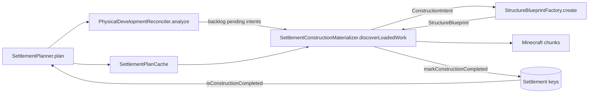
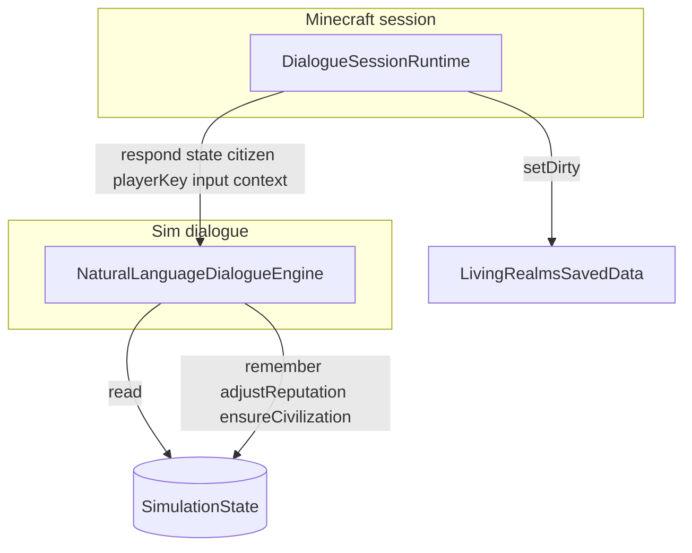

# Architecture inventory — modular-monolith refactor targets

Inventory of **ten** high-mass classes at baseline `HEAD` `2180af61be07146ba2fca1894d8489eaabe03e92` (`cursor/architecture-depth-pass-f4a7`).  
Purpose: concrete extraction inputs for a modular monolith. Only systems present in source are named.

**Inventory classes (10):**

| # | Class | Layer |
|---|--------|--------|
| 1 | `NaturalLanguageDialogueEngine` | sim dialogue |
| 2 | `StructureBlueprintFactory` | sim construction geometry |
| 3 | `SettlementPlanner` | sim construction intents |
| 4 | `RealmDashboardCodec` | sim UI wire codec |
| 5 | `SettlementConstructionMaterializer` | minecraft construction projection |
| 6 | `CivilizationLifecycleEngine` | sim civilization day pipeline |
| 7 | `SimulationStateCodec` | sim persistence |
| 8 | `RealmDashboardScreen` | minecraft client UI |
| 9 | `LivingRealmsEvents` | minecraft server bridge |
| 10 | `SimulationState` | sim canonical state |

CURRENT PINS (from `docs/ARCHITECTURE.md`): schema 20 / minSchema 1 / protocol 20 / network 16 / contentRevision 15 / surfaceSettlements 36 / perRealm 3 / spacing 2000.

---

## Dependency map (all ten)

```
                    ┌─────────────────────────────────────┐
                    │  DashboardClientState (client)      │
                    └──────────────┬──────────────────────┘
                                   │ RealmDashboardCodec JSON
                    ┌──────────────▼──────────────────────┐
                    │  RealmDashboardScreen               │
                    │  (snapshot-only; DashboardAction*)  │
                    └─────────────────────────────────────┘
                                   ▲
                                   │ RealmDashboardBuilder (not inventoried)
LivingRealmsEvents ────────────────┼──────────────────────────► Minecraft world
  │ tick / join-leave / death       │
  │ commands / interact             │
  ▼                                 │
SimulationState ◄── DialogueSessionRuntime ── NaturalLanguageDialogueEngine
  │ advanceDays / recordPhysical*   │              (read/write citizen/standing)
  │ collections + embedded engines  │
  ├── CivilizationEngine ──► CivilizationLifecycleEngine
  │                              └──► SettlementPlanner (refugee shelter pending)
  ├── LivingRealmsSavedData ──► SimulationStateCodec
  └── presentationScope / catch-up flags
           │
           ▼
SettlementConstructionMaterializer
  │ PhysicalDevelopmentReconciler / PrimaryEconomyPlanner / SettlementPlanCache
  │ StructureBlueprintFactory ◄── SettlementPlanner.plan (CultureArchitectureProfile)
  └── markConstructionCompleted ──► Settlement.completedConstruction keys
```

| From → To | Coupling |
|---|---|
| `NaturalLanguageDialogueEngine` → `SimulationState` | Heavy read; writes memories, relationships, player standing, lazy `ensure*Civilization` |
| `SettlementPlanner` → `StructureBlueprintFactory` | Indirect via `CultureArchitectureProfile.bind` / `forIntent` |
| `SettlementConstructionMaterializer` → `StructureBlueprintFactory` | Blueprint → terrain-aware `BuildOperation`s |
| `SettlementConstructionMaterializer` → `SettlementPlanner` | **Indirect** via reconciler/plan cache pending intents |
| `SettlementConstructionMaterializer` → `SimulationState` | Catch-up consumption, presentation scope activation |
| `CivilizationLifecycleEngine` → `SettlementPlanner` | Shelter pending check for refugee camps |
| `CivilizationLifecycleEngine` → `SimulationState` | Heavy collection/faction/settlement mutation |
| `SimulationState` → `CivilizationLifecycleEngine` | Via embedded `CivilizationEngine` |
| `SimulationStateCodec` → `SimulationState` | Full binary mirror; rebuilds engines on decode |
| `LivingRealmsEvents` → `SimulationState` | Day advance, physical-loss feedback, commands |
| `LivingRealmsEvents` → `SettlementConstructionMaterializer` | Phase-0 construction tick, catch-up, clear |
| `LivingRealmsEvents` → `SimulationStateCodec` | Indirect via `LivingRealmsSavedData` dirty/save |
| `RealmDashboardCodec` → `SimulationState` | **None** (DTO codec only) |
| `RealmDashboardScreen` → `SimulationState` | **None** (`RealmDashboardSnapshot` only) |
| `RealmDashboardScreen` → `RealmDashboardCodec` | Client decode path via `DashboardClientState` |

---

## Circular responsibilities (cross-class)

| Cycle / entanglement | Classes involved | Risk |
|---|---|---|
| **Construction closed loop** | `SettlementPlanner` emits intents → materializer completes keys → `pending` shrinks → planner re-run | Ordering bugs in culture bind vs house blueprints |
| **Dual blueprint consumers** | `SettlementConstructionMaterializer` (terrain) vs `ConstructionJob.resolve` (flat Y) | Divergent geometry semantics |
| **Dialogue as sim read API** | `NaturalLanguageDialogueEngine` touches crime, war, markets, routes, legends, assistance | Query paths with lazy civilization side effects |
| **Dashboard action vocabulary** | `RealmDashboardScreen` + `LivingRealmsEvents` commands overlap found/bounty/faction/assist | Duplicate player agency surfaces |
| **God-day pipeline** | `CivilizationLifecycleEngine` vs `CrimeEngine` / `NavalEngine` / `CivilizationEngine.updateSettlements` | Duplicate domain authority |
| **God-event hub** | `LivingRealmsEvents` tick schedule + projection + crime + commands | Hard to test phases in isolation |
| **God-object + orchestrator** | `SimulationState` stores, soft-caps, `advanceDays`, law façade | Last extraction; highest blast radius |
| **Monolithic save envelope** | `SimulationStateCodec` knows every domain layout | Module split requires section delegates or schema bump |
| **Flat dashboard codec** | `RealmDashboardCodec` mirrors entire snapshot | Builder/codec limit drift |

---

## Suggested extraction order (architecture directive Waves 2–7)

Extractions follow **outer boundaries first**, then **construction pipeline**, then **server bridge**, then **canonical core** (schema 20 remains the persistence contract until deliberately bumped).

| Wave | Theme (directive) | Primary inventory targets | Extraction focus |
|---|---|---|---|
| **2** | Client dashboard contract & agency presentation | `RealmDashboardCodec`, `RealmDashboardScreen` | Per-section JSON codecs; tab panels / map renderer / action panels; thin screen façade. Preserves snapshot-only boundary to `SimulationState`. |
| **3** | Construction truth (sim-only intents & geometry) | `StructureBlueprintFactory`, `SettlementPlanner` | Blueprint role modules; morphology / parcels / civic catalog splits; document or isolate `CultureArchitectureProfile` bind side channel. Feeds Wave 3 player-structure revalidation tests without touching chunks. |
| **4** | Physical construction & housing loop | `SettlementConstructionMaterializer` | `construction-discovery`, `construction-terrain`, `construction-apply`, `construction-completion` modules; keep `tick` in minecraft layer. Closes planner → world → `completedConstruction` loop (Wave 4 housing/demolition gates). |
| **5** | Player-facing sim dialogue & social writes | `NaturalLanguageDialogueEngine` | `dialogue-nlu`, topic resolvers, `dialogue-social`; keep thin `respond` coordinator. Aligns with Wave 5 player agency / founder flows (session in `DialogueSessionRuntime`). |
| **6** | NeoForge integration shell | `LivingRealmsEvents` | `SimulationTickScheduler`, `ProjectionIndexLifecycle`, `PhysicalLossBridge`, `PlayerWorldInteractionBridge`, `LivingRealmsCommands`; thin `@SubscribeEvent` forwarder. Reduces overlap with dashboard/command agency (Wave 6 war room). |
| **7** | Canonical persistence & day core | `SimulationStateCodec`, `CivilizationLifecycleEngine`, `SimulationState` | Section codecs + migrations under one envelope; lifecycle method-cluster engines; peel `SimulationCatalog`, `SimulationDayLoop`, `PhysicalLossService`, law façade from `SimulationState` **last**. Wave 7 underworld/schema-20 fields stay in composed codec until split is proven by tests. |

**Within-wave ordering:** complete Wave 2 before relying on split dashboard types; complete Waves 3–4 before moving construction callers; Wave 5 dialogue can parallel Wave 4 once `SimulationState` lookups are stable; Wave 6 before Wave 7 so tick/loss paths do not churn while codec/state split lands.

---

## Class inventories

## 1. `NaturalLanguageDialogueEngine` (~215 lines, ~51KB compiled)

**Path:** `src/main/java/dev/livingrealms/sim/dialogue/NaturalLanguageDialogueEngine.java`

### Responsibilities

- **Conversation orchestration:** `respond(SimulationState, SocialCitizen, playerKey, input, DialogueContext)` — intent dispatch, response assembly, action list, context update.
- **NLU (no LLM):** `parse(String, DialogueContext)` — normalization, follow-up resolution (`ASK_SOURCE`, `ASK_DIRECTION`), `DialoguePhraseTable.longest` matching, fallback `UNKNOWN`.
- **Domain Q&A handlers (private `answer*`):** self/age/job/family/health; ruler/dynasty/settlement/faction/politics/law/crime/tax; food/water/resources/trade/price/technology/school; war/army/guards/route/migration; culture/religion/history/rumor/calendar; danger/direction/source/recent/help/opinion.
- **Social gameplay:** `interaction`, `reportInformation` — relationship deltas, memories, reputation, guard alerts.
- **Presentation helpers:** `compose` (deterministic phrasing), `level`/`stockLevel`/`pretty`, resource parsing (`parseResource`, Dutch/English aliases), spatial narration (`direction`, `directionPhrase`, `findKnownSettlement`).
- **Knowledge gating:** `authority`, role-based detail tiers, citizen `latestMemory` filters, `WorldCauseExplainer.settlementPressureCause` for causal prose.

### State owned

- **None at class level** — stateless service; only nested `record Parsed(DialogueIntent, DialogueTopic, String subject)`.
- **Per-call mutable inputs:** `DialogueContext` (updated via `context.update(...)`); `List<DialogueAction> actions` built per `respond`.

### Dependencies (calls into)

| Area | Types / APIs |
|------|----------------|
| World clock & lookup | `SimulationState.clock()`, `findFaction`, `findSettlement`, `findSettlementOwner`, `findSocialCitizen` |
| Civilization (lazy ensure) | `ensureSettlementCivilization`, `ensureFactionCivilization` |
| Social | `SocialCitizen`, `CitizenMemory`, `MemoryType`, `CitizenRelationship`, `FamilyBond`, `GuildRank` |
| Faction / settlement | `Faction`, `Settlement`, `DynastyState`, `Army`, `ResourceType`, `ResourceClaim` |
| Economy | `LocalMarketEngine.quote` |
| Transport | `TransportRoute`, `CartographicKnowledgeEngine.localPrecision` |
| Justice / crime | `state.crimeLedger()`, `state.justiceCases()`, `JusticeCase` |
| Diplomacy / war | `state.wars()`, `WarState` |
| Society / events | `CivicEvent`, `AssistanceTask`, `LegendRecord`, `FaithCatalog`, `CivilizationCalendar` |
| Dialogue infra | `DialogueIntent`, `DialogueTopic`, `DialogueAction`, `DialogueActionType`, `DialogueContext`, `DialoguePhraseTable`, `DialogueResult` |
| Roles | `CitizenRole` |
| Explainers | `WorldCauseExplainer` |

### Mutations performed

- **`SocialCitizen.remember(...)`** — every `respond` (conversation log); plus `interaction`, `reportInformation`, threat/insult paths.
- **`CitizenRelationship.adjust(...)`** — `interaction` (compliment, apologize, threaten, insult).
- **`state.playerStanding(playerKey).adjustReputation(factionId, ...)`** — `interaction`.
- **`DialogueContext.update(intent, topic, subject, day)`** — end of `respond`.
- **Lazy civilization materialization:** `ensureSettlementCivilization` / `ensureFactionCivilization` may create or fill civilization side-records on first dialogue touch (same pattern as other sim engines).
- **Does not** mutate settlements, factions, wars, or construction keys directly.

### Callers (ripgrep)

| Caller | Usage |
|--------|--------|
| `dev.livingrealms.minecraft.network.DialogueSessionRuntime` | Static `ENGINE`; `open` / `openAdopted` / `reply` → `respond` |
| `dev.livingrealms.sim.dialogue.DialoguePhraseTable` | Javadoc reference to `parse` |
| Tests | `CivilizationLayerTest`, `SocietyDialogueTest`, `DialogueTokenTest`, `SettlementTransferTest`, `HumanityLifecycleTest`, `FaithAndInfrastructureTest` |

### Persistence coupling

- Indirect: all writes go through **`SocialCitizen`** (memories, relationships) and **`PlayerStanding`** on `SimulationState`, which are serialized with realm save data.
- **`DialogueContext`** is session-transient (`DialogueSessionRuntime.SESSIONS`), not persisted.
- **`ensure*Civilization`** touches civilization maps on `SimulationState` (persisted if newly created).

### Minecraft coupling

- **None in this class** — pure `sim.*` / `sim.dialogue` / `sim.social` / `sim.civilization`.
- Minecraft entity/session wiring lives in **`DialogueSessionRuntime`** (distance checks, packets, gift shrink, guard targeting).

### Client coupling

- **None direct.** Client receives text via network payloads built in `DialogueSessionRuntime`; `DialogueAction` side effects (waypoints, trade bridge) applied server-side.

### Circular responsibilities / entanglement

- **Omnibus “world explainer”:** one class reads crime, war, markets, routes, legends, civic events, assistance tasks, dynasties, and civilization pressure — dialogue becomes a secondary read API for half the sim.
- **Lazy `ensure*Civilization` on read paths** blurs query vs. initialization (side effect during conversation).
- **`answerHelp`** embeds command hints (`/livingrealms assist deliver`) and synthesizes `OFFER_TASK` actions from both `AssistanceTask` list and civilization pressure heuristics.
- **Duplicated market knowledge:** `LocalMarketEngine` here vs. trade UI elsewhere.

### Suggested extraction targets (justified by existing code)

| Target module | Extract | Rationale |
|---------------|---------|-----------|
| `dialogue-nlu` | `parse`, `normalize`, `DialoguePhraseTable` integration, `inferTopic`, `subjectFor` | Already isolated entry; no `SimulationState` in `parse` except context. |
| `dialogue-resolvers` | One resolver per `DialogueTopic` / intent cluster (`SettlementDialogue`, `WarDialogue`, `EconomyDialogue`, …) | `respond` switch is the natural seam; each resolver: `(state, citizen, parsed, day) → (text, actions)`. |
| `dialogue-social` | `interaction`, `reportInformation`, opinion/gift/threat paths | Sole writers of relationship + player reputation from chat. |
| Keep in core | `respond` orchestration + `DialogueContext` contract | Thin coordinator. |

---

## 2. `StructureBlueprintFactory` (~684 lines, ~46KB)

**Path:** `src/main/java/dev/livingrealms/sim/construction/StructureBlueprintFactory.java`

### Responsibilities

- **Blueprint factory:** `create(ConstructionIntent)` — `switch (intent.role())` to ~40 structure generators (`keep`, `townHall`, `house`, `farm`, `road`, … wizard variants).
- **Culture-aware housing:** `house(ConstructionIntent)` — `CultureArchitectureProfile.forIntent`, size thresholds (mansion / `apartmentBlock` / culture-specific cottages, longhouses, etc.).
- **Override API:** `create(ConstructionIntent, CultureArchitecture)` — binds settlement architecture then builds `HOUSE`.
- **Procedural geometry DSL:** shared builders — `foundation`, `shell`, `doorway`, `windows`, `pitchedRoof`, `flatRoof`, `battlements`, `furnishHome` (bed pairs for materializer), `clear` (AIR phases).
- **Road styling:** `road` uses `StreetType.forWidth` + rural vs urban sidewalk/furniture rules.
- **Deterministic variation:** `variant(intent, bound)` hash from `settlementId` + intent key.

### State owned

- **None** (static utility class).
- **Process-wide side channel:** reads/writes **`CultureArchitectureProfile`** settlement bindings via `create(intent, CultureArchitecture)` → `bind(settlementId, culture)`; `house()` reads `forIntent` → `peek(settlementId)`.

### Dependencies

- `ConstructionIntent`, `StructureRole`, `StructureBlueprint`, `BlockPlacement`, `PaletteSlot`, `ConstructionPhase`
- `CultureArchitecture`, `CultureArchitectureProfile` (`forIntent`, `bind`, `derive` fallback)
- `StreetType` (road blueprints)

### Mutations performed

- **In-memory only:** `CultureArchitectureProfile.bind` when using culture override overload.
- **Output:** immutable `StructureBlueprint` lists (no canonical settlement mutation).

### Callers (ripgrep)

| Caller | Usage |
|--------|--------|
| `SettlementConstructionMaterializer` | `buildingOperations`, `terrainFollowingOperations` → `create(intent)` |
| `ConstructionJob` | `resolve` → `create(intent)` at fixed `groundY` (headless / simpler path) |
| `PropertyRightsEngine` | Blueprint footprint for property logic |
| Tests | `SettlementStreetGraphTest`, `SocietyInfrastructureTest`, `OrganicMorphologyAndCauseTest`, `WorldgenQualityTest`, `ProductionQualityTest`, `LivingWorldDensityTest`, `CoreSimulationTest`, `SystemCompletenessTest`, `WizardTreesTest`, `CultureArchitectureDerivationTest` |

### Persistence coupling

- **None** — pure function of `ConstructionIntent` (+ optional JVM-global culture binding map, not saved).

### Minecraft coupling

- **None** — slot-based blueprints; comment states palettes resolved later by adapter (`FactionBlockPalette` in materializer).

### Client coupling

- **None.**

### Circular responsibilities / entanglement

- **Housing massing + culture policy** in one file with civic/industrial/military/wizard geometry.
- **Implicit coupling to planner:** `CultureArchitectureProfile` bindings must be set by `SettlementPlanner.plan` before house blueprints are consistent in-process.
- **`ConstructionJob.resolve` vs materializer** duplicate blueprint→operation projection (materializer adds terrain, doors, entrance planner).

### Suggested extraction targets

| Target | Extract |
|--------|---------|
| `blueprint-housing` | `house`, culture switches, `furnishHome`, residential variants |
| `blueprint-civic` | halls, market variants, temple, courthouse, etc. |
| `blueprint-infrastructure` | `road`, `plaza`, `wall`, `gate`, `aqueduct`, `irrigation` |
| `blueprint-grammar` | `foundation`/`shell`/roof helpers shared module |
| Keep | `create(ConstructionIntent)` façade delegating by `StructureRole` |

---

## 3. `SettlementPlanner` (~674 lines, ~46KB)

**Path:** `src/main/java/dev/livingrealms/sim/construction/SettlementPlanner.java`

### Responsibilities

- **Master plan:** `plan(Faction, Settlement)` → ordered `List<ConstructionIntent>` (immutable copy).
- **Pending filter:** `pending` → `plan` minus `settlement.isConstructionCompleted(key)`.
- **Layout metadata:** `layoutArchetype(Settlement)` / `(Faction, Settlement)` → `SettlementMorphology.derive(...).wireName()`.
- **Morphology-driven roads:** `addRoadNetwork` — tier/morphology branches (`COASTAL_PORT`, `RIVER_TOWN`, `HILL_TOWN`, `RADIAL_CAPITAL`, `ORGANIC_MEDIEVAL`, …).
- **Residential pipeline:** `addHousing` + `extendSideStreetsForHousing` — `SettlementStreetGraph`, `SettlementParcelPlanner`, `DevelopmentMode` (PLAYER_LED / HYBRID / auto).
- **Peripheral economy:** `addFarms`, `addPastures` (population-scaled, morphology-aware placement).
- **Tier-gated civic catalog:** well → village bundle (market, temple, mill, …) → town (barracks, school, prison, …) → city (walls, gates, monument, aqueduct, airfield).
- **Capital / player-founded rules:** town hall vs keep ordering; keep sizing from capital + tier.
- **Priority policy:** `adjustPriority(DevelopmentPriority, StructureRole, base)`; final `replaceAll` + sort by priority.
- **Geometry helpers:** `local` rotation, `civicPoint`, `addAt`, `key` generation (tier-scoped keys for road/keep/wall/gate).

### State owned

- **None** (static).
- **Side effect:** `CultureArchitectureProfile.bind(settlement.id(), cultureProfile.architecture())` at start of `plan`.

### Dependencies

- `Faction`, `Settlement`, `SettlementOrigin`, `DevelopmentMode`, `DevelopmentPriority`, `SimPosition`
- `SettlementMorphology`, `SettlementGrowthLayer`, `StreetType`
- `CultureArchitectureProfile`, `CultureArchitecture`
- `SettlementStreetGraph`, `SettlementParcelPlanner`
- Reads **`settlement.completedConstruction()`** only in `pending` (via `isConstructionCompleted`).

### Mutations performed

- **None on `Settlement` / `Faction` during `plan`.**
- **`CultureArchitectureProfile.bind`** (JVM-global, affects subsequent `StructureBlueprintFactory` house massing).

### Callers (ripgrep)

| Caller | Usage |
|--------|--------|
| `SettlementPlanCache` | Cached `SettlementPlanner.plan` |
| `PhysicalDevelopmentReconciler` | `pending` for backlog |
| `SettlementConstructionMaterializer` | Indirect via reconciler / economy planners / `SettlementPlanCache` |
| `CitizenRoutinePlanner` | `pending` + economy pending |
| `CivilizationLifecycleEngine` | shelter pending counts |
| `HouseholdHomeBinder`, `SettlementDistrictPlan`, `IndustrySitePlanner`, `CivicFestivalDecorationPlanner`, `ForeignSettlementAdoption` | `plan` / stream intents |
| `FactionCitizenMaterializer`, `PlayerMarketRuntime` | locate completed structures (prison, keep, market) |
| Many tests | plan determinism, tier growth, morphology |

### Persistence coupling

- **Inputs from persisted settlement:** tier, population, housing, `developmentMode`/`developmentPriority`, `origin`, `completedConstruction` keys, geography, position.
- **Outputs are derived** each call (cached by `SettlementPlanCache` key); intents themselves not stored — only completion keys on `Settlement`.

### Minecraft coupling

- **None** — strategic coordinates only (`SimPosition`).

### Client coupling

- **None direct** (dashboard may show settlement stats influenced by planned-but-incomplete work via other builders).

### Circular responsibilities / entanglement

- **Single class owns:** street morphology, parcel layout, housing counts, civic catalog, walls/gates, and development policy — hard to test or replace one layer.
- **Global culture bind** ties planner execution order to blueprint factory in same JVM (ordering bug = wrong architecture).
- **Many downstream callers re-run full `plan`** for one intent lookup (market, prison, homes) — performance/semantic coupling to complete plan cost.

### Suggested extraction targets

| Target | Extract |
|--------|---------|
| `settlement-morphology` | Already partially `SettlementMorphology`; keep road network generation per morph |
| `settlement-parcels` | `addHousing`, `extendSideStreetsForHousing` + parcel planner integration |
| `settlement-civic-catalog` | Tier-gated `addCivic` tables and `civicPoint` offsets |
| `construction-intent-keys` | `key(...)`, priority adjustment |
| Facade | `SettlementPlanner.plan` composes sub-planners |

---

## 4. `RealmDashboardCodec` (~228 lines, ~40KB)

**Path:** `src/main/java/dev/livingrealms/sim/ui/RealmDashboardCodec.java`

### Responsibilities

- **Wire protocol:** `encode(RealmDashboardSnapshot)` → JSON string; `decode(String)` → snapshot.
- **Schema version gate:** `v` must equal `RealmDashboardSnapshot.PROTOCOL_VERSION`.
- **Size bound:** `MAX_JSON_CHARS` (262_144); encode throws if exceeded; decode rejects oversize input.
- **Snapshot projection mapping:** nested encode/decode for jurisdiction, player, realm, settings, factions, settlements, wars, warfare, bounties, operations, ecology, politics, forces, strategic map, history.
- **Defensive decode:** list limits from `RealmDashboardBuilder.MAX_*` constants per section.
- **JSON mechanics:** `MiniJson.stringify` / `parse`; typed helpers `obj`, `list`, `longNum`, `str`, `bool`, etc.

### State owned

- **Constants only:** `MAX_JSON_CHARS`.
- **No instance fields.**

### Dependencies

- `RealmDashboardSnapshot` (+ all nested view records)
- `RealmDashboardBuilder` (limit constants only)
- `dev.livingrealms.sim.data.MiniJson`

### Mutations performed

- **None** (pure transform).

### Callers (ripgrep)

| Caller | Usage |
|--------|--------|
| `LivingRealmsNetwork` | Server: `encode` after `RealmDashboardBuilder.build` |
| `DashboardSnapshotPayload` | Validates length against `MAX_JSON_CHARS` |
| `DashboardClientState` | Client: `decode` incoming JSON |
| Tests | Round-trip, protocol rejection, size bounds (`SystemCompletenessTest`, `Schema18FollowUpTest`, `OrganicMorphologyAndCauseTest`) |

### Persistence coupling

- **None** — transport DTO codec; snapshot is ephemeral per request.

### Minecraft coupling

- **Transport only** — used from NeoForge network layer and client UI state; no world/block APIs.

### Client coupling

- **Strong protocol coupling:** client `DashboardClientState` must decode same schema; field names and limits are the contract.

### Circular responsibilities / entanglement

- **Large flat codec** mirrors entire `RealmDashboardSnapshot` surface (map layers, ecology, forces, operations) — any builder change requires paired encode/decode edits.
- **Limits duplicated** between builder (generation) and codec (decode caps) — intentional but brittle.

### Suggested extraction targets

| Target | Extract |
|--------|---------|
| `dashboard-protocol` | Version constant + `encode`/`decode` façade |
| Per-section codecs | `encodeMap`/`decodeMap`, `encodeOperations`, … (private methods already name seams) |
| Optional | Generated or test-driven round-trip fixture per protocol version |

---

## 5. `SettlementConstructionMaterializer` (~621 lines, ~40KB)

**Path:** `src/main/java/dev/livingrealms/minecraft/construction/SettlementConstructionMaterializer.java`

### Responsibilities

- **Tick driver:** `tick(ServerLevel, LivingRealmsSavedData)` — catch-up consumption, presentation scope, job discovery, `ConstructionQueue.tick` with op budget, completion/rejection handling.
- **Proximity discovery:** `discoverLoadedWork` — players within 640 blocks, fair settlement rotation, merges `PhysicalDevelopmentReconciler` backlog + `PrimaryEconomyPlanner.pending` (or `WizardTreesPlanner` for wizard factions).
- **Terrain-aware jobs:** `createTerrainAwareJob`, `findBuildSite`, `terrainStats`, `roadOperations`, `terrainFollowingOperations`, wizard underground search.
- **Blueprint application:** `buildingOperations` / terrain ops → **`StructureBlueprintFactory.create`**, rotation, foundation piers, `EntranceAccessPlanner`.
- **Block application:** `apply` — palette via `FactionBlockPalette` + `FactionCivilizationState` traditions, doors/beds, `WorldMutationGuard`, `AuthoredBlockLedger`.
- **Completion pipeline:** access probe (`WorldStructureAccessProbe`), `Settlement.markConstructionCompleted`, housing credit (`creditHousingFromCompletedHouse` + `HousingCapacity` + `SettlementPlanCache`).
- **Catch-up:** `requestCatchup`, `consumeConstructionCatchup` from sim state, boosted op budget.
- **Lifecycle:** `clear`, test hooks `queueEmpty`, `boundLevelIdentity`.

### State owned (static / process)

| Field | Purpose |
|-------|---------|
| `QUEUE` | `ConstructionQueue` — in-flight jobs |
| `JOB_OWNERS` | job wire key → `Settlement` for completion |
| `RETRY_AFTER_DAY` | backoff after defer/reject/access fail |
| `boundLevelIdentity` | single `ServerLevel` binding (E8 guard) |
| `catchupTicks`, `catchupSimulatedDays`, `catchupIntentsPerSettlement`, `catchupOpsBoost` | catch-up ramp |
| `settlementScanCursor` | fair discovery rotation |

Constants: `ACTIVATION_RADIUS`, `MAX_QUEUED_JOBS`, `MAX_SETTLEMENTS_PER_DISCOVERY`.

### Dependencies

**Sim**

- `ConstructionIntent`, `ConstructionJob`, `ConstructionQueue`, `ConstructionRetryKey`, `BuildOperation`, `BuildApplyResult`, `StructureBlueprintFactory`, `StructureGeometryRules`, `EntranceAccessPlanner`, `HousingCapacity`, `PhysicalDevelopmentReconciler`, `SettlementPlanCache`, `PrimaryEconomyPlanner`, `WizardTreesPlanner`, `AuthoredBlockLedger`, `AuthoredOwnerType`, `PaletteSlot`, `StructureRole`
- `Faction`, `Settlement`, `FactionCivilizationState`, `WizardTreesSeeder`, `ModCompatibilityPolicy`

**Minecraft**

- `ServerLevel`, `BlockPos`, `BlockState`, `Heightmap`, block tags, `DoorBlock`, `BedBlock`, `Blocks`, `BuiltInRegistries`
- `LivingRealmsSavedData`, `SimulationRuntime`, `WorldMutationGuard`, `WorldStructureAccessProbe`, `FactionBlockPalette`

### Mutations performed

| Target | What |
|--------|------|
| **World** | `level.setBlock` for structure ops; tree/vegetation clear on roads |
| **`AuthoredBlockLedger`** | `record` / ownership on successful apply |
| **`Settlement`** | `markConstructionCompleted`, `setActiveConstructionKey`, `addHousing` on house complete |
| **`SimulationState`** | `consumeConstructionCatchup`, `presentationScope().setActivated` |
| **`LivingRealmsSavedData`** | `setDirty()` on progress/completion |
| **Static queue maps** | enqueue/dequeue, retry days |

### Callers (ripgrep)

| Caller | Usage |
|--------|--------|
| `LivingRealmsEvents` | Phase-0 tick; `requestCatchup` on day drain/spawn; `clear` on unload |
| `SpawnKingdomRuntime` | `requestCatchup` after kingdom spawn |
| `ConstructionOrigin` enum | Documents materializer as completion authority |
| `SimulationState` | Comment on catch-up flag consumed here |

### Persistence coupling

- **Canonical completion** on `Settlement.completedConstruction` keys (sim save).
- **Housing** tallies updated on house completion (sim save).
- **Authored blocks** ledger persisted in `LivingRealmsSavedData`.
- **Queue/retry static state** explicitly disposable (rebuilt from pending intents).

### Minecraft coupling

- **Heavy** — chunk load checks, heightmap, fluids, multi-block doors/beds, player proximity activation.

### Client coupling

- **Indirect** — players see blocks appear; no direct packet API in this class.

### Circular responsibilities / entanglement

- **Planner + reconciler + economy + wizard planner + blueprint factory + terrain + access probe + housing** in one tick path.
- **Dual blueprint projection:** materializer reimplements blueprint→ops with terrain; `ConstructionJob.resolve` uses flat Y (test/legacy path).
- **Static global queue** — one world per JVM assumption (`boundLevelIdentity`).

### Suggested extraction targets

| Target | Extract |
|--------|---------|
| `construction-discovery` | `discoverLoadedWork`, retry/backoff, wizard vs normal pending sources |
| `construction-terrain` | `findBuildSite`, `roadOperations`, `terrainFollowingOperations` |
| `construction-apply` | `apply`, door/bed/palette (Minecraft adapter module) |
| `construction-completion` | access gate, mark completed, housing credit |
| Keep in minecraft | `tick` wiring to `ServerLevel` / saved data |

---


---

## 6. `CivilizationLifecycleEngine`

**Path:** `src/main/java/dev/livingrealms/sim/civilization/CivilizationLifecycleEngine.java` (~766 lines / ~100KB dense)  
**Type:** `public final class` — **stateless** (no instance fields beyond `MAX_NAMED_CITIZENS` constant). All work is `static` helpers + two public entry points.

### Responsibilities (domains currently owned)

- **Day orchestration** — `simulateDay` (L25–41): cadence-gated lifecycle pass.
- **Culture / dynasty bootstrap** — `ensureCulturalPoliciesAndDynasties`, `ensureRulerCitizen`, `refreshDynasties`, `evolveCultureAndLaw`.
- **Household graph** — `ensureHouseholds` (create/merge/deactivate/repair), `simulateHouseholdLifecycle`, birth/adoption/`FamilyMaterializer`, wages (`payWages`).
- **Epidemics** — spawn/update/containment, named victims, trade-route spread (`simulateEpidemics`, `spreadDiseaseAlongTrade`).
- **Migration columns & refugee camps** — `considerMigration`, `advanceMigrationGroups`, `establishRefugeeCamp` (creates `Settlement`s + pending construction pressure).
- **Knowledge diffusion** — settlement/route knowledge, tech spillover, apprenticeships.
- **Civic life** — festivals/rituals (`simulateCivicEvents`), holy-order pressure (`applyHolyOrderPresence`).
- **Espionage & propaganda** — operations and campaigns with diplomatic/crime side effects.
- **Justice loop** — NPC crime spawn, case investigation/sentencing/exile/execution (`spawnNpcCrime`, `advanceJusticeCases`).
- **Hidden wealth caches** — bury/recover/raid via intelligence.
- **Political marriages** — court spouse relocation + diplomatic opinion.
- **Piracy** — bands, hideouts, shipment interception, fleet engagements.
- **Ruins** — abandonment/loot/reclaim/weathering.
- **Assistance task pressure board** — opens/updates `AssistanceTask`s from settlement stress.

### State owned

- **None** (engine is pure). Constant: `MAX_NAMED_CITIZENS = 8_000`.
- Mutates **caller-owned** `SimulationState` and nested mutable domain objects.

### Dependencies (classes/engines called)

| Dependency | Usage |
|---|---|
| `SimulationState` | Primary read/write surface |
| `SocialPopulationEngine` | `allocateVirtualProjectionSlot`, `rebindAfterMigration` |
| `FamilyMaterializer` | Adult child materialization |
| `HouseholdHomeBinder` | Home key assignment |
| `AssistanceContributionEngine` | Infrastructure pressure |
| `SettlementPlanner` | Pending shelter check for refugee camps |
| `FaithCatalog` / `DiseaseProfile` / `GuildRank` / `CivilizationCalendar` | Catalogs/profiles |
| `AppearanceProfile` | Ruler personification |
| `WizardTreesSeeder.FACTION_NAME` | Arcana knowledge boost |
| Domain types | `Faction`, `Settlement`, `SocialCitizen`, `HouseholdState`, `MigrationGroup`, `EpidemicRecord`, `JusticeCase`, `CrimeLedger`/`reportCrime`, `PirateBand`/`PirateHideout`, `Fleet`, `TradeShipment`, `WorldEvent`, etc. |

Does **not** call Minecraft APIs.

### Mutations performed

Representative writes (not exhaustive):

- **Collections:** `addHousehold`, `addSocialCitizen`, `addMigrationGroup`, `addEpidemic`, `addAssistanceTask`, `addCivicEvent`, `addIntelligenceOperation`, `addPropagandaCampaign`, `addRuinSite`, `addJusticeCase`, `addHiddenCache`, `addPirateBand`/`addPirateHideout`, `addDiplomaticMarriage`, `addCustody`, `ensureDynasty` / dynasty fields.
- **Settlement/Faction:** population, housing, stockpiles, prosperity/unrest/order/employment/foodSecurity, development priority, rename camps→havens, treasury, technology, diplomatic relations, government legitimacy/stability.
- **Civilization overlays:** `SettlementCivilizationState` / `FactionCivilizationState` pressures, knowledge, quarantine, law policy, culture traits, spy networks.
- **Citizens/households:** money, needs, health, death, memories, relationships, migrate, profession skill, household membership/wealth/children.
- **Law:** `state.reportCrime(...)`, custody, executions via `recordPhysicalCitizenDeath`.
- **Trade/naval:** `recordPhysicalShipmentLoss` (piracy), fleet losses/experience.
- **History:** many `WorldEvent` types (`migration_*`, `epidemic_*`, `court_*`, `piracy`, …).

### Callers (ripgrep)

| Caller | How |
|---|---|
| `CivilizationEngine` (L16, L24–26) | Field `lifecycleEngine`; `considerMigration` weekly; `simulateDay` every day |
| `CivicChoreographyPlanner` | Comment-only alignment with day-clock semantics |
| Tests | Indirect via `CivilizationEngine` / soak / civilization layer tests |

`SimulationState.advanceDays` → `civilizationEngine.simulateDay` → this class.

### Persistence coupling

- **None directly.** All mutated records are schema-backed via `SimulationStateCodec` (esp. v12–v14 humanity/civilization blocks).
- Refugee camps create real `Settlement`s that enter the faction graph and thus the save.

### Minecraft coupling

- **None** (pure `sim.*`).

### Client coupling

- **None.** Dashboard may *display* consequences (assistance, epidemics, etc.) via snapshot builders elsewhere.

### Circular / entanglement notes

- **God-day pipeline:** one class owns disease, migration, justice, espionage, propaganda, piracy, dynasties, wages, knowledge — domains already partly covered by `CrimeEngine`, `NavalEngine`, `SocialPopulationEngine`, `CivilizationEngine.updateSettlements`.
- **Overlaps with `CivilizationEngine`:** claims/bandits/demography vs lifecycle epidemics/migration/households; weekly migration is split (`considerMigration` here, attraction elsewhere).
- **Overlaps with law engines:** `spawnNpcCrime` + `advanceJusticeCases` vs `CrimeEngine` / `LawEnforcementEngine` used from `SimulationState.reportCrime` / day tick.
- **Construction entanglement:** `establishRefugeeCamp` knows `SettlementPlanner` / `StructureRole` to force physical pending builds.
- Class comment (L17–20) claims no duplicate population/economy authority, yet it adjusts population, stockpiles, food security, wages, and tech.

### Suggested extraction targets (justified by existing method clusters)

| Module | Existing methods |
|---|---|
| `HouseholdLifecycleEngine` | `ensureHouseholds`, `simulateHouseholdLifecycle`, `materializeAdultChild`, `adoptOrphans`, `payWages` |
| `EpidemicEngine` | `simulateEpidemics`, `markNamedEpidemicVictims`, `spreadDiseaseAlongTrade` |
| `MigrationEngine` | `considerMigration`, `advanceMigrationGroups`, `establishRefugeeCamp`, attach/move households |
| `KnowledgeEngine` | `diffuseKnowledge`, `applyKnowledgeBenefits`, `trainApprentices` |
| `CivicEventEngine` | `simulateCivicEvents`, `applyHolyOrderPresence` |
| `IntelligencePropagandaEngine` | `simulateIntelligenceOperations`, `simulatePropagandaCampaigns` |
| `CourtJusticeEngine` | `spawnNpcCrime`, `advanceJusticeCases`, sentence/exile helpers |
| `PiracyEngine` | `simulatePiracy`, fleet engagement helpers |
| `DynastySuccessionEngine` | `ensureCulturalPoliciesAndDynasties`, `refreshDynasties`, `simulatePoliticalMarriages`, `evolveCultureAndLaw` |
| `AssistanceBoardEngine` | `simulateAssistanceTasks` |
| `RuinEngine` | `simulateRuins` |
| `HiddenCacheEngine` | `simulateHiddenCaches` |

Keep a thin `CivilizationLifecycleEngine.simulateDay` as a cadence façade, or fold cadence into `CivilizationEngine`.

---

## 7. `SimulationStateCodec`

**Path:** `src/main/java/dev/livingrealms/sim/persistence/SimulationStateCodec.java` (~743 lines / ~91KB)  
**Type:** `public final` utility; private ctor; all static.

### Responsibilities

- **Versioned binary persistence** for the entire canonical world (`MAGIC=0x4C52534D` “LRSM”).
- **Schema gate:** `MIN_SUPPORTED_SCHEMA=1`, `SCHEMA_VERSION=20`, size caps `MAX_STATE_BYTES` / `MAX_STRING_BYTES`.
- **Integrity:** `integrityToken` = CRC32+1 (0 reserved for legacy SavedData).
- **Encode path:** validate → write header (seed, ticks, nextId) → layered writers → history.
- **Decode path:** header → version-conditional readers → migrate helpers for pre-v16/v17/v18/v19 → `repairNextIdWatermark` → validate if current schema.
- **Layered schema writers/readers:** regions, factions/gov/armies/relations, shipments, v4 strategic, v5 custody, v6 naval/players, v7 industry, v9 config, v11 social, v12 civilization, v13 humanity, v14 pirate hideouts, v15 siege equipment, v16 settlement economy, v17 final product, v18 goods/origins, v19 provenance/sites/underworld profiles/player structures, v20 underworld contracts + stolen goods.

### State owned

- **None** (stateless codec). Schema constants only.

### Dependencies

- Nearly every `sim.*` domain type that is persisted.
- `SimulationValidator` on encode and on current-schema decode.
- `SpeciesCatalog` / caller-supplied species map on decode (live species must exist in catalog).
- **No** Minecraft types (comment L37: “No Minecraft classes required”).

### Mutations performed

- **Encode:** read-only of `SimulationState` (after validate).
- **Decode:** constructs new `SimulationState`, `restore*` / `add*` for all collections, migrates stockpiles/appearance/provenance when upgrading old schemas.

### Callers (ripgrep)

| Caller | Role |
|---|---|
| `LivingRealmsSavedData` | Production load/save + integrity check |
| Many `src/testCore` tests | Round-trip, migration matrix, fuzz, integrity |
| `LivingRealmsReleaseGameTests` | GameTest encode/decode |
| `scripts/release-audit.py`, `write-release-manifest.py` | Pin `SCHEMA_VERSION` |
| `DocumentationPinTest` | Const pin |
| `AuthoredBlockLedger` | Documents that block ledger is **outside** this payload |

### Persistence coupling

- **This class is the persistence boundary** for canonical sim state.
- Schema bumps are coordinated with `LivingRealmsSavedData` outer NBT keys and release pins.
- Explicit non-coverage: authored block ledger, ephemeral queues (`playerStructureRevalidation*`, `presentationScope`, engine instances).

### Minecraft coupling

- **None in source.** Minecraft wraps bytes in NBT via `LivingRealmsSavedData`.

### Client coupling

- **None.**

### Circular / entanglement notes

- **Monolithic schema surface:** one class knows field layouts for every domain → any module split must either (a) keep a single codec with section delegates, or (b) introduce per-module codecs composed under one envelope.
- Encode order is fixed; decode branches on version — migration logic is co-located with I/O (hard to move without dual-maintenance).
- `ResourceType.values()` ordinals are baked into multiple sections → enum evolution is a schema event.

### Suggested extraction targets

| Module | Existing methods |
|---|---|
| `CodecHeader` / integrity helpers | `inspectSchema`, `integrityToken`, string/position/count helpers |
| `EcologyCodec` | `writeRegions` / `readRegions` |
| `FactionSettlementCodec` | `writeFactions`, `writeGovernment`, settlement economy/origins/provenance slices |
| `StrategicCodec` | `writeV4Strategic`, treaties/wars/routes/sieges/air/bounties/crime ledger |
| `SocialCodec` | `writeV11Social` + citizen extensions in v13/v17 |
| `CivilizationHumanityCodec` | `writeV12Civilization`, `writeV13Humanity`, v14 hideouts |
| `WorldSitesCodec` | outlying/journey/roadside/player structures (v19) |
| `UnderworldCodec` | profiles (v19) + contracts/stolen goods (v20) |
| `SaveMigration` | `migratePreV16*`, `migratePreV17*`, `migratePreV18*`, `migratePreV19*` |

Keep a single public `encode`/`decode` façade so `LivingRealmsSavedData` and tests stay stable.

---

## 8. `RealmDashboardScreen`

**Path:** `src/main/java/dev/livingrealms/minecraft/client/ui/RealmDashboardScreen.java` (~975 lines / ~61KB)  
**Type:** `public final class extends Screen` (Minecraft client GUI).

### Responsibilities

- **Tabbed strategic UI** over an immutable `RealmDashboardSnapshot` (class comment L18).
- **Widget rebuild** per tab: law, diplomacy, war room, army orders, faction join/leave/abdicate/found, influence petitions, economy tax/market, settlement development priorities/modes/register house, settings presets, map open.
- **Read-only line renderers** for overview/kingdoms/politics/settlements/society/wars/economy/ops/forces/ecology/history.
- **Strategic map paint** (`renderStrategicMap`, claims/armies/shipments).
- **Accessibility scaling** via `DashboardAccessibility`.
- **Action emission only** — never mutates sim state locally; uses `DashboardClientState.sendAction` / `requestRefresh` / `requestOpenMap`.

### State owned (UI-only)

| Field | Role |
|---|---|
| `snapshot` | Current `RealmDashboardSnapshot` |
| `tab` | Active `Tab` enum |
| `page` | Pagination (bounties / settlements / market / text) |
| `contentScroll` | Mouse-wheel scroll in content pane |
| `foundNameBox` / `foundNameDraft` | Found-settlement name editor |

Constants: `BOUNTIES_PER_PAGE = 4`. Nested: `Line` record, `Tab` enum (14 tabs).

### Dependencies

- Minecraft client: `Screen`, `GuiGraphics`, `Button`, `EditBox`, `Tooltip`, `Component`.
- `RealmDashboardSnapshot`, `DashboardActionCommand`, `MarketTransactionEngine.PACKAGE_UNITS` (label sizing only), `ImportantNotifications`, `DashboardAccessibility`, `DashboardClientState`.

### Mutations performed

- **Local UI state only** (tab/page/scroll/draft/snapshot replace).
- **Canonical state:** none on client. Intended mutations go as `DashboardActionCommand` packets (server applies via action service — outside this class).

Actions emitted (by tab builders):  
`SURRENDER`, `PAY_FINE`, `BOUNTY_ACCEPT`/`ABANDON`, `PETITION_PEACE`, `PROPOSE_TRADE_PACT`, army defend/rally/stand-down/capture/siege/raid/escort/patrol, `DECLARE_WAR`, `ABDICATE`, `FACTION_LEAVE`, `FACTION_JOIN_LOCAL`, `FOUND_SETTLEMENT`, influence (`REQUEST_AUDIENCE`, `PROPOSE_PROJECT`, …), `TAX_LOWER`/`RAISE`, `MARKET_BUY`/`SELL`, settlement priority actions, `SET_DEVELOPMENT_MODE`, `REGISTER_BUILDING`, config presets.

### Callers (ripgrep)

| Caller | How |
|---|---|
| `DashboardClientState.receive` | `new RealmDashboardScreen(decoded)` or `replaceSnapshot` if already open |
| `scripts/release-audit.py` | Static content pins |

### Persistence coupling

- **None.** Snapshot is network JSON (`RealmDashboardCodec`), not `SimulationStateCodec`.

### Minecraft coupling

- **Full client GUI** (NeoForge/Minecraft Screen stack). Must stay in `minecraft.client` module.

### Client coupling

- **This is the client dashboard.** Paired with `RealmWorldMapScreen` via shared `DashboardClientState`.

### Circular / entanglement notes

- **UI + action wiring + rendering in one file:** tab button factories, line composition, and map drawing are co-located (~975 lines).
- Soft coupling to server action vocabulary (`DashboardActionCommand.Action`) — screen knows command shapes (e.g. market resource ordinal encoding).
- Does not touch the other nine inventory classes directly.

### Suggested extraction targets

| Module | Existing methods |
|---|---|
| `DashboardTabBar` / layout helpers | `rebuildDashboardWidgets`, `tabColumns`/`tabRows`/`contentTop` |
| `DashboardActionPanels` | `rebuildLawButtons`, `rebuildDiplomacyButtons`, `rebuildWarRoomButtons`, `rebuildArmyOrderButtons`, `rebuildFactionButton`, `rebuildInfluenceButtons`, `rebuildEconomyButtons`, `rebuildSettlementButtons`, `rebuildSettingsButtons` |
| `DashboardTabContent` | `*Lines()` methods |
| `StrategicMapRenderer` | `renderStrategicMap`, `drawWorldLine`/`drawClaim`/`factionColor` |
| Keep thin `RealmDashboardScreen` | lifecycle: `init`, `render`, input, `replaceSnapshot` |

---

## 9. `LivingRealmsEvents`

**Path:** `src/main/java/dev/livingrealms/minecraft/LivingRealmsEvents.java` (~678 lines / ~56KB)  
**Type:** `public final` NeoForge event subscriber (registered from `LivingRealms`).

### Responsibilities

- **Server tick orchestration** (`onServerTick`): species catalog hot-reload; discovery runtimes; staggered materializers (wildlife, citizens, caravans, military, mobile civ, air/naval, bounty hunters, siege, roadside, festivals, geography, player structures, seasonal farms); regional impostors / far presence; day-advance scheduler drain; construction materializer phases; **once per Minecraft day** `state.advanceDays(strategicDaysPerStep)`; mid-day `advancePresentationPulse(0.5)`.
- **Projection index join/leave** for all Living Realms entity kinds.
- **Physical → canonical loss feedback** on leave/death (animals, citizens, journeys, armies, migrations/pirates, aircraft, ships, caravans).
- **Player interaction bridges:** dialogue open, hidden caches, container theft prep, industrial sabotage crime on block break, structure revalidation dirtying.
- **Logout / server stop cleanup** of indexes, limiters, materializer caches, day scheduler.
- **Species reload listener** registration.
- **Combat/law reactions** on `LivingDeathEvent` (bounty claims, murder crime, combat service awards).
- **Command surface** `/livingrealms …` (wanted, faction, industry, bounty, assist, found, locate, status, setday, advance, advance_day).

### State owned

| Field | Role |
|---|---|
| `tickCounter` | Schedules phased work; reset on server stop |
| `appliedSpeciesRevision` | Last applied `SpeciesDataRegistry` revision |

No canonical world state stored here.

### Dependencies (representative)

- **Runtime glue:** `SimulationRuntime`, `LivingRealmsSavedData`, `SpeciesDataRegistry`.
- **Many materializers/indexes/runtimes:** wildlife, citizens, caravans, military, mobile civilization, aircraft, ships, bounty hunters, siege, regional impostors, construction/urban/industry/roadside/festival, ambience, choreography, crime/custody/theft, assistance, hidden cache, pirate hideout, historical sites, player structures, onboarding, waystones, foreign discovery, ecosystem discovery, spawn kingdom.
- **Sim APIs:** `SimulationState.advanceDays` / `advancePresentationPulse` / `recordPhysical*` / crime & bounty / join-leave faction / `PlayerSettlementFounder` / `LocateQuery` / `ManualDayAdvanceScheduler` / `TerritoryEngine` / `IndustrySitePlanner`.
- **NeoForge/Minecraft events & commands.**

### Mutations performed

- Marks `LivingRealmsSavedData` dirty after sim writes.
- Mutates canonical state through `SimulationState` methods listed above (day advance, physical losses, crimes, bounties, service, settlement founding via commands).
- Clears ephemeral projection indexes on stop.
- Does **not** call `SimulationStateCodec` directly.

### Callers (ripgrep)

| Caller | How |
|---|---|
| `LivingRealms` | `NeoForge.EVENT_BUS.register(new LivingRealmsEvents())` |
| NeoForge event bus | All `@SubscribeEvent` methods |
| `scripts/release-audit.py`, `SingleProductionAuthorityTest` | Static guards on source text |

### Persistence coupling

- Indirect: `data.setDirty()` after mutations; save uses codec in `LivingRealmsSavedData`.
- Day advance and physical losses are the main dirty sources from this class.

### Minecraft coupling

- **Primary Minecraft↔sim bridge.** Entire class is server-side NeoForge integration.

### Client coupling

- **None directly** (server events). Clears dashboard/dialogue **limiters** on logout (server-side rate limit state), not client screens.

### Circular / entanglement notes

- **God-event hub:** tick schedule + entity lifecycle + crime + commands + discovery in one type.
- Death handling duplicated between `onEntityLeave` and `onLivingDeath` for several projection kinds (must stay consistent).
- Tick phasing encodes performance policy that could live in a dedicated scheduler module.
- Commands duplicate some dashboard actions (found, bounty, faction join/leave, assist).

### Suggested extraction targets

| Module | Existing methods / blocks |
|---|---|
| `SimulationTickScheduler` | `onServerTick` body (phases, day advance, presentation pulse) |
| `ProjectionIndexLifecycle` | `onEntityJoin` / `onEntityLeave` |
| `PhysicalLossBridge` | leave + death canonical feedback + `awardCombatService` |
| `PlayerWorldInteractionBridge` | interact / container / block break-place |
| `LivingRealmsCommands` | `onCommands` + locate helpers |
| Keep thin `LivingRealmsEvents` | `@SubscribeEvent` forwarding only |

---

## 10. `SimulationState`

**Path:** `src/main/java/dev/livingrealms/sim/world/SimulationState.java` (~509 lines / ~55KB)  
**Type:** `public final` — **canonical authoritative state** (class comment L34).

### Responsibilities

- **Own all persisted (and some ephemeral) world collections** plus ID watermark.
- **Embed and sequence day engines** in `advanceDays` (L470–506).
- **Lookup / ensure / add / soft-cap** APIs for every major collection.
- **Physical-loss adapters** (`recordPhysical*`) for Minecraft projection feedback.
- **Law façade:** `reportCrime`, arrest/bounty/custody helpers delegating to crime/law/bounty/reputation engines + underworld observe.
- **Player standing / underworld / dynasties** accessors.
- **Species catalog replace** with live-population safety + habitat reseeding.
- **Ecosystem region discovery** (`ensureEcosystemRegion`).
- **Manual day jump** (`advanceToDay`) and **presentation pulse** (shipments/migrations/siege nudge without full engines).
- **Summary string** for logging/commands.

### State owned

**Identity / clock / config**

- `seed`, `SimClock clock`, `SimulationConfig config`, `Map<String,SpeciesDefinition> species`, `Map<String,EcoBiome> biomes`, `nextId`

**Canonical collections (persisted via codec)**

- Ecology: `regions`
- Politics/economy: `factions`, `shipments`, `treaties`, `wars`, `routes`, `objectives`, `sieges`, `airWings`, `ports`, `fleets`, `industrialSites`
- Law: `bounties`, `custody`, `crimeLedger`
- Social/civ: `socialCitizens`, `settlementCivilizations`, `factionCivilizations`, `households`, `resourceClaims`, `raids`, `legends`, `epidemics`, `migrationGroups`, `justiceCases`, `hiddenCaches`, `pirateBands`, `pirateHideouts`, `diplomaticMarriages`, `civicEvents`, `intelligenceOperations`, `propagandaCampaigns`, `ruinSites`, `assistanceTasks`, `dynasties`
- Sites/mobility: `outlyingSites`, `citizenJourneys`, `roadsideSites`, `registeredPlayerStructures`
- Government extras: `debts`, `grandProjects`, `campaignPlans`
- Players/underworld: `playerStandings`, `underworldProfiles`, `underworldContracts`, `stolenGoodsLedger`
- Meta: `history`, `liveness`

**Ephemeral (not in codec)**

- `playerStructureRevalidationQueue` / `playerStructureRevalidationSet`
- `SettlementPresentationScope presentationScope`
- `pendingConstructionCatchupDays`
- Embedded **engine instances** (recreated on `new SimulationState` / decode)

**Embedded engines (fields L95–118)**

`EcologyEngine`, `FactionEngine`, `TradeEngine`, `SocietyEngine`, `GovernmentEngine`, `SovereignDebtEngine`, `GrandProjectEngine`, `HeroEngine`, `RebellionEngine`, `DiplomacyEngine`, `TransportNetworkEngine`, `MilitaryCommandEngine`, `AviationEngine`, `CrimeEngine`, `BountyOfficeEngine`, `LawEnforcementEngine`, `NavalEngine`, `ReputationEngine`, `IndustryEngine`, `PrimaryEconomyEngine`, `SettlementEconomyEngine`, `SocialPopulationEngine`, `SocialMobilityEngine`, `CivilizationEngine` (→ lifecycle).  
Also calls static `RoadLifeEngine`, `SettlementExpansionEngine`, `UnderworldActions`, `HabitatPopulationSeeder` from methods.

### Dependencies

- Broad `sim.*` packages (see imports L3–31).
- Orchestrates engines listed above inside `advanceDays`.
- **No** Minecraft imports.

### Mutations performed

- All collection mutations via `add*` / `ensure*` / `restore*` / remove helpers.
- `advanceDays`: runs full engine pipeline then `clock.advance(TICKS_PER_DAY)`; monthly snapshot history.
- `advancePresentationPulse`: trade presentation + migration crawl + siege army nudge.
- Physical loss methods mutate groups/citizens/armies/fleets/etc. + history.
- Law/reputation/underworld side effects through façades.

### Callers (ripgrep)

Extremely wide. Production hotspots:

- `LivingRealmsEvents` / `LivingRealmsSavedData` / materializers / runtimes under `minecraft.*`
- All day engines under `sim.*`
- `SimulationStateCodec`
- `RealmDashboardBuilder`, `DashboardActionService`, `PlayerAgencyActions`, dialogue, validators, seeders
- Most `src/testCore` tests

Among the ten inventory classes: used by **LifecycleEngine**, **Codec**, **Events**; **not** by `RealmDashboardScreen`.

### Persistence coupling

- **Primary codec subject.** Soft-cap constants (`MAX_*`) must stay aligned with codec `checkedCount` limits.
- Engines and ephemeral queues are intentionally non-persisted.

### Minecraft coupling

- **None in type.** Designed so Minecraft only projects/feeds back via adapters.

### Client coupling

- **None.** Client sees snapshots built elsewhere from this state.

### Circular / entanglement notes

- **God-object bag + orchestrator + law façade:** storage and day scheduling and multi-engine wiring live together.
- Soft-cap pruning logic duplicated per collection type inside this class.
- `CivilizationEngine` (and thus lifecycle) is a field here while lifecycle mutates sibling collections — fine compositionally, but hard module boundary (state module vs civilization module).
- Presentation pulse embeds trade/migration/siege knowledge that could live in those engines (trade already has `presentationPulse`).

### Suggested extraction targets

| Module | Justification in existing code |
|---|---|
| `SimulationCatalog` / stores | Collection fields + `add*`/`find*`/`ensure*`/`MAX_*` |
| `SimulationDayLoop` | `advanceDays`, `advanceToDay`, `advancePresentationPulse` |
| `PhysicalLossService` | `recordPhysical*` methods |
| `LawFacade` (or keep on law module) | `reportCrime`, bounty/arrest/custody/join/leave |
| Keep `SimulationState` as façade | Thin delegates so codec/call sites stay stable during split |

Do **not** invent new engines not already present; extractions should move existing private/public method clusters.

---

## Cross-cutting: construction pipeline coupling



### `SettlementPlanner` ↔ `SettlementConstructionMaterializer` ↔ `StructureBlueprintFactory`

1. **Intent production (sim):** `SettlementPlanner.plan` emits deterministic `ConstructionIntent` lists (positions, roles, keys, priorities). `pending` subtracts keys in `settlement.completedConstruction()`.
2. **Culture side channel:** `SettlementPlanner.plan` calls `CultureArchitectureProfile.bind(settlementId, architecture)`. `StructureBlueprintFactory.house` / `forIntent` reads that binding to pick massing (cottage vs longhouse vs apartment). Override API `StructureBlueprintFactory.create(intent, culture)` also binds — used in tests.
3. **Caching:** Materializer and reconciler use **`SettlementPlanCache.plan`** (not always raw planner) for stable intent lists when crediting housing or analyzing deficits.
4. **Backlog selection (sim → minecraft):** Materializer does **not** call `SettlementPlanner` directly. It uses **`PhysicalDevelopmentReconciler.analyze(...).backlog()`** (which wraps `SettlementPlanner.pending`) plus **`PrimaryEconomyPlanner.pending`** (and **`WizardTreesPlanner.pending`** for wizard factions).
5. **Geometry (sim):** **`StructureBlueprintFactory.create(intent)`** turns intent into slot/phased `BlockPlacement`s — no world Y.
6. **Materialization (minecraft):** Materializer maps blueprints to **`BuildOperation`s** with terrain base Y, road bridging, entrance fixes, then applies blocks. Completion writes **`settlement.markConstructionCompleted(intentKey)`** — closing the loop so planner `pending` shrinks.
7. **Receipt gating:** Jobs may complete physically but defer canonical completion if **`WorldStructureAccessProbe`** fails (door→road), setting **`RETRY_AFTER_DAY`**.
8. **Parallel path:** **`ConstructionJob.resolve`** also calls `StructureBlueprintFactory` at a single `groundY` (headless/simpler materialization without terrain) — two blueprint consumers.

---

## Cross-cutting: dialogue ↔ `SimulationState`



### How dialogue couples to `SimulationState`

- **Entry contract:** Every `respond` requires live **`SimulationState`**, **`SocialCitizen`**, and **`playerKey`** (crime/standing identity). Session layer ensures citizen exists (`ensureSocialCitizen` on open).
- **Read surface:** Engine pulls from most major state collections: `factions`, settlements (via faction), `socialCitizens`, `dynasties`, `wars`, `routes`, `resourceClaims`, `crimeLedger`, `justiceCases`, `civicEvents`, `assistanceTasks`, `legends`, `playerStanding`, civilization maps via **`ensure*`**.
- **Write surface:**
  - **`SocialCitizen`**: memories (all chats + reports + interactions), relationships.
  - **`PlayerStanding`**: faction reputation adjustments.
  - **Civilization records**: lazy creation via **`ensureSettlementCivilization` / `ensureFactionCivilization`** on many answer paths (water, health, settlement, culture, religion, migration, danger, help).
- **Time:** **`state.clock().day()`** drives age, calendar, war duration, memory recency, civic event windows.
- **Not coupled:** dialogue does not enqueue construction, mutate settlements’ completion keys, or run market transactions (actions delegate to **`DialogueSessionRuntime.applyActions`** / `PlayerMarketRuntime` / guards).
- **Persistence path:** `DialogueSessionRuntime` calls **`data.setDirty()`** after `respond` because citizen/standing/civilization may change.

---

## Cross-cutting refactor notes (all ten)

1. **Authority line is documented and mostly honored:** `SimulationState` is canonical; `LivingRealmsEvents` and materializers project; `SimulationStateCodec` persists; dashboard stack is snapshot-only; dialogue writes only through citizen/standing/civilization lazy ensures.
2. **Largest modularity wins with least invention:** follow Waves 2–7 table above; do not invent engines absent from source.
3. **Preserve boundaries:** client UI ↔ codec ↔ snapshot builder ↔ `SimulationState`; sim construction ↔ minecraft materializer via intents and completion keys only.
4. **Schema 20 / protocol 20** are wire and save contracts — composed codecs must preserve encode order and migration behavior or bump pins deliberately.

---

## File sizes at inventory baseline (`2180af6`)

| Class | Lines (`wc -l`) |
|---|---|
| `NaturalLanguageDialogueEngine` | 215 |
| `StructureBlueprintFactory` | 684 |
| `SettlementPlanner` | 674 |
| `RealmDashboardCodec` | 228 |
| `SettlementConstructionMaterializer` | 621 |
| `CivilizationLifecycleEngine` | 766 |
| `SimulationStateCodec` | 743 |
| `RealmDashboardScreen` | 975 |
| `LivingRealmsEvents` | 678 |
| `SimulationState` | 509 |

---

## Document history

| Date | Branch | Scope |
|------|--------|--------|
| 2026-10-05 | `cursor/architecture-depth-pass-f4a7` | Initial inventory (construction + dialogue): commit `ca7908c` |
| 2026-10-05 | `cursor/architecture-inventory-8227` | Core/state inventory: commit `333da75` |
| 2026-10-05 | `cursor/architecture-depth-pass-f4a7` | **Consolidated** ten-class inventory + Waves 2–7 extraction order |
